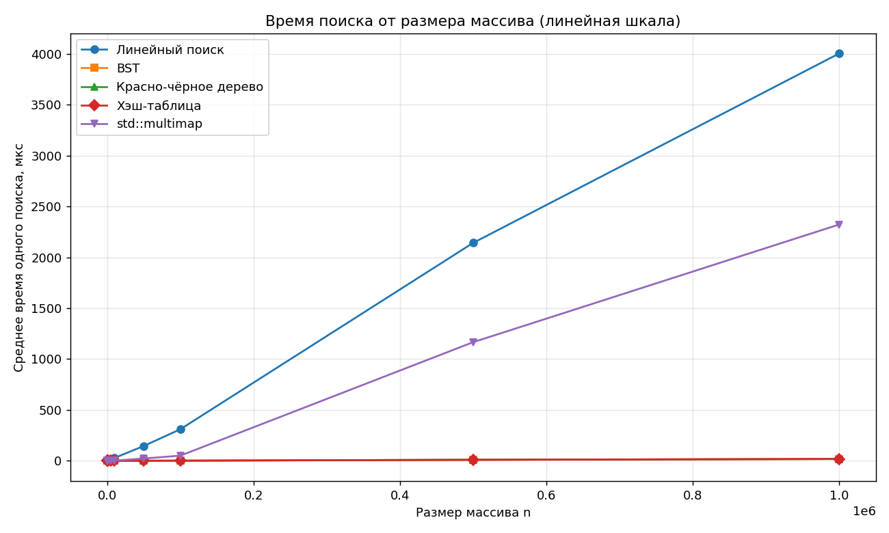
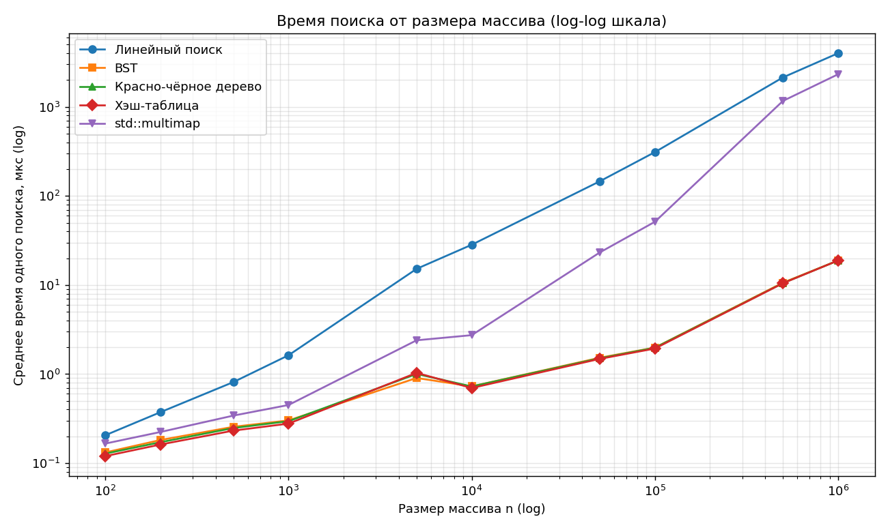
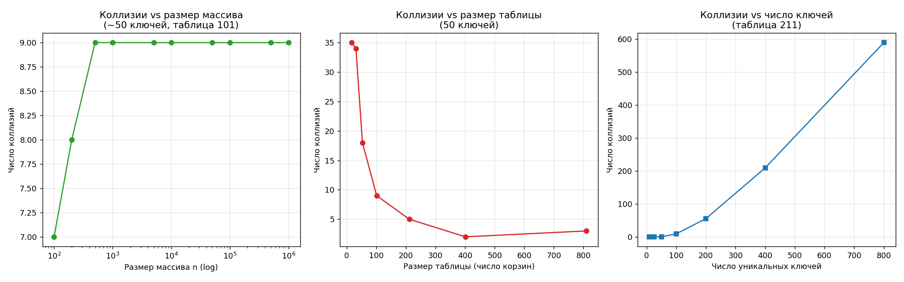

# Лабораторная работа: Алгоритмы поиска данных

**Вариант 21** — массив авиарейсов, прибывающих в аэропорт.

## Постановка задачи

Реализовать на C++ поиск **всех вхождений** элемента в массиве объектов по
ключу четырьмя методами (линейный поиск, бинарное дерево поиска,
красно-чёрное дерево, хэш-таблица), реализовать собственную хэш-функцию и
разрешение коллизий, подсчитать коллизии, замерить время поиска на наборах
разной размерности, сравнить с `std::multimap` и построить графики.

## Структура данных

Каждый рейс (`struct Flight`) описывается полями:
- номер рейса (`flightNumber`),
- авиакомпания (`airline`),
- дата прилёта (`arrivalDate`, формат `YYYY-MM-DD`),
- время прилёта по расписанию (`arrivalTime`, формат `HH:MM`),
- число пассажиров на борту (`passengers`).

## Выбор ключа

Ключом по заданию является первое нечисловое поле. Формально это номер
рейса, но он по построению уникален (префикс авиакомпании + индекс),
поэтому поиск всех вхождений по нему вырождается в поиск одного элемента.
В качестве ключа взято следующее нечисловое поле — **авиакомпания
(`airline`)**: оно неуникально (используется ~50 авиакомпаний), что и
требуется условием задачи (ключи в массиве не уникальны).

## Реализованные методы поиска

Все структуры хранят в одном узле/ячейке **все** рейсы с данным ключом,
поэтому поиск всех вхождений сводится к поиску одного узла.

- **Линейный поиск** — проход по всему массиву, O(n) на запрос.
- **Бинарное дерево поиска** (BST) — несбалансированное, поиск O(h).
- **Красно-чёрное дерево** (RBT) — самобалансирующееся, поиск O(log n) в
  худшем случае; полная реализация вставки с поворотами и перекраской,
  используется узел-страж `nil`.
- **Хэш-таблица** — собственная полиномиальная хэш-функция (схема Горнера,
  множитель 31), разрешение коллизий методом цепочек, подсчёт коллизий.
- **`std::multimap<airline, Flight>`** — поиск через `equal_range`, для
  сравнения со стандартной библиотекой.

## Сборка и запуск

Требуется g++ с поддержкой C++20 (тестировалось на MinGW-w64 / UCRT64 16.1.0).

```bash
.\build.bat
.\search_lab.exe
```

Программа для размерностей 100, 200, 500, 1000, 5000, 10000, 50000,
100000, 500000, 1000000 строит все структуры, выполняет по 50 поисков
(включая заведомо отсутствующие ключи) с замером времени по минимуму из 5
прогонов и записывает результаты в `data/timings.csv`. Отдельно проводится
исследование коллизий (`data/collisions_study.csv`).

Для построения графиков:
```bash
pip install matplotlib pandas
python scripts/plot_timings.py
```

## Структура проекта
- search-flight/
- -  main.cpp              — весь исходный код
- - build.bat             — сборка одной командой
- - Doxyfile              — конфигурация документации
- - data/
- - - timings.csv       — время поиска по методам
- - - collisions_study.csv — исследование коллизий
- - - plot_search_linear.png — время поиска (линейная шкала)
- - - plot_search_log.png    — время поиска (log-log шкала)
- - - plot_collisions.png    — графики коллизий
- - scripts/
- - - plot_timings.py   — построение графиков
- - docs/html/            — Doxygen-документация

## Результаты

### Время поиска: линейная шкала



На линейном масштабе виден линейный рост времени линейного поиска: на
1000000 элементов он занимает около 4 миллисекунд на запрос, тогда как
деревья и хэш-таблица лежат фактически на оси X. `std::multimap` тоже
растёт линейно, но примерно вдвое медленнее линейного поиска. При малых
объёмах данных разница между методами минимальна.

### Время поиска: логарифмическая шкала



В log-log координатах степенные зависимости превращаются в прямые с
наклоном, равным показателю степени. Линейный поиск и `std::multimap` дают
прямые с наклоном примерно 1 (O(n)), а BST, RBT и хэш-таблица идут почти
вместе тонким пучком внизу с малым наклоном.

Важное наблюдение: BST, RBT и хэш-таблица растут с n **не из-за стоимости
поиска ключа** (уникальных ключей всего ~50, поэтому структуры маленькие и
поиск ключа почти константный), а из-за **размера результата** — на больших
n каждый ключ встречается десятки тысяч раз, и время уходит на копирование
всех найденных вхождений. Поэтому три «быстрых» метода практически
неразличимы. `std::multimap` медленнее их, так как `equal_range`
выгружает совпадения через обход отдельных узлов дерева, тогда как наши
структуры хранят все рейсы одного ключа в плотном векторе.

### Коллизии хэш-функции



- **Коллизии vs размер массива** (левый график): так как уникальных ключей
  всего ~50, число коллизий не зависит от n — оно быстро выходит на ~9 и
  далее остаётся постоянным.
- **Коллизии vs размер таблицы** (средний график): при малом числе корзин
  (17) — до 35 коллизий, с ростом таблицы число коллизий быстро падает
  почти до нуля (зависимость от коэффициента загрузки).
- **Коллизии vs число уникальных ключей** (правый график): при фиксированной
  таблице (211 корзин) пока ключей мало (≤50) коллизий почти нет, при росте
  числа ключей коэффициент загрузки превышает 1 и коллизии растут.

## Выводы

- Линейный поиск приемлем только на малых данных (до ~1000 элементов);
  начиная с десятков тысяч он на порядки медленнее остальных методов: на
  1000000 элементов это ~4 мс против ~20 мкс у хэша — разница в ~200 раз.
- BST, RBT и хэш-таблица при малом числе уникальных ключей практически
  неразличимы по времени, так как узкое место — не поиск ключа, а размер
  ответа. Преимущество RBT над обычным BST проявилось бы на большом числе
  уникальных, упорядоченно вставляемых ключей, когда обычный BST вырождается
  в список — в нашем эксперименте такого не было.
- Хэш-таблица — стабильно самый быстрый метод; её эффективность зависит от
  выбора размера таблицы (коэффициента загрузки).
- `std::multimap` быстрее линейного поиска, но уступает собственным
  деревьям и хэшу из-за накладных расходов на обход дерева в `equal_range`.
- Число коллизий определяется не размером массива, а коэффициентом загрузки
  таблицы (отношением числа уникальных ключей к числу корзин).

## Документация

Документация к коду сгенерирована через Doxygen. Для просмотра:
```bash
doxygen Doxyfile
start docs/html/index.html
```
